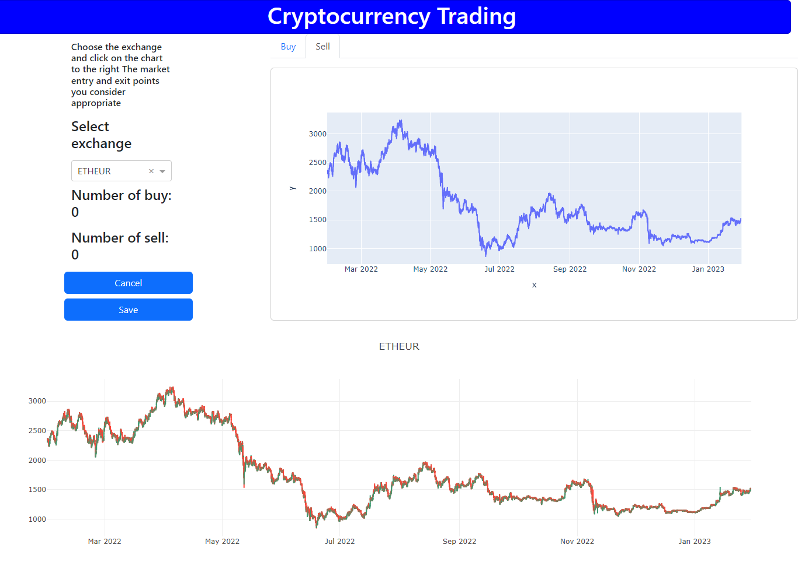

#   Análisis de Criptomonedas usando Fast Trading Label

Fast Trading Label es una herramienta para etiquetar rápidamente los datos de criptomonedas, elija el intercambio y haga clic en el gráfico a la derecha los puntos de entrada y salida del mercado que considere apropiados.

    

##  Ejecución
Ejecutar el archivo **data_downloader.py** para descargar la lista de las criptomonedas y las guardara en la carpeta **DATA**

Ejecutar el archivo **main.py**

Ingresar a la dirección: http://127.0.0.1:8050/

##  Requisitos

Plotly: Versión actual 5.13.0
`pip install plotly`

Dash:  actual 2.8.0
`pip install dash`
`pip install dash-bootstrap-components`

Pandas: Versión actual 1.5.3
`pip install pandas`

OS: Versión actual 2.1.4
`pip install os-sys`

Binance: Versión actual 1.0.16
`pip install python-binance`

Clients: Versión actual 1.4
`pip install clients`